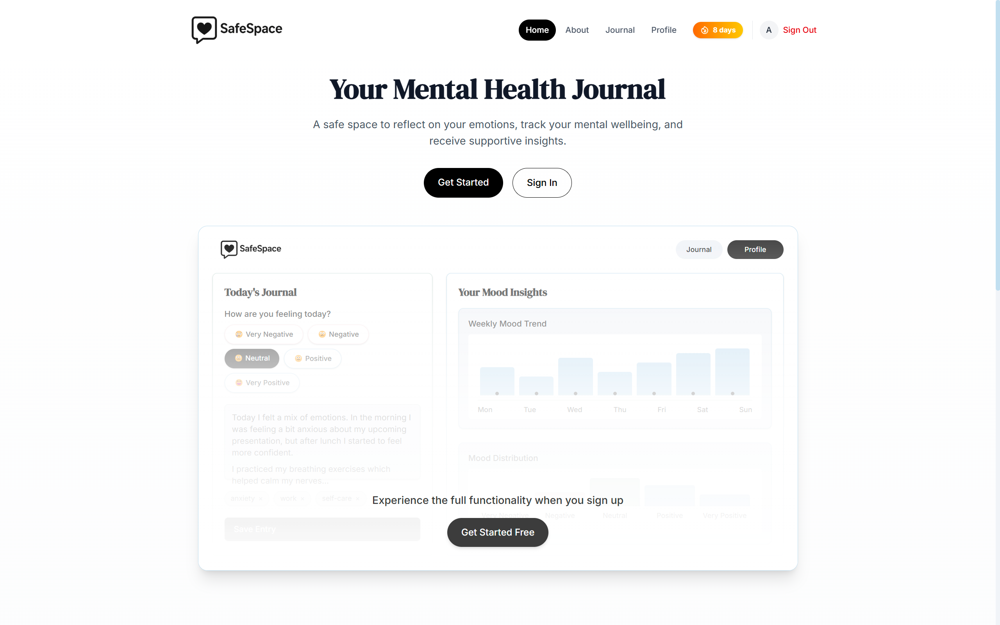
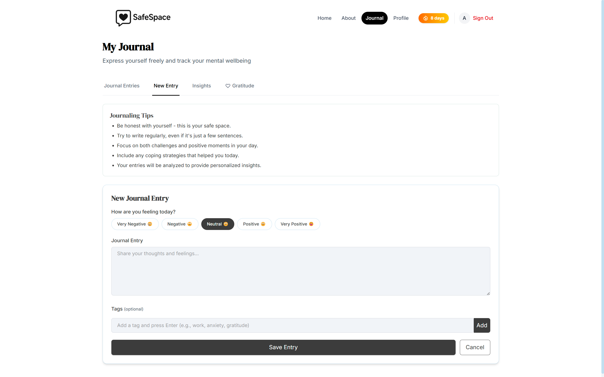
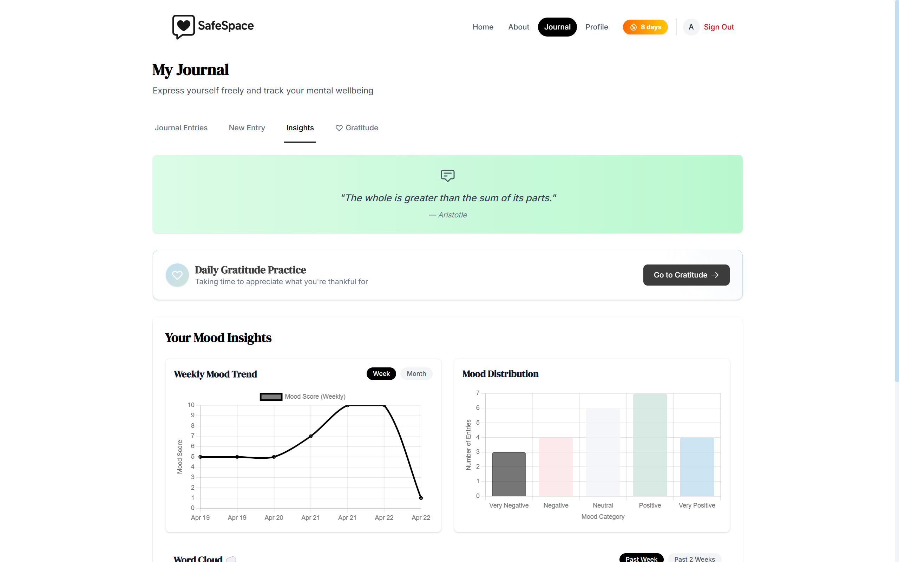

# SafeSpace 🧘‍♀️
## A Digital Sanctuary for Mental Wellness



*SafeSpace is a digital sanctuary designed to support your emotional wellness through reflective journaling, mood tracking, and personalized AI-powered insights.*

## ✨ Why SafeSpace?

In today's fast-paced world, mental self-care often takes a backseat. SafeSpace creates a dedicated environment where you can pause, reflect, and nurture your emotional wellbeing. Our platform combines thoughtful journaling tools with gentle AI guidance to help you:

- **Understand** your emotional patterns
- **Process** complex feelings through writing
- **Discover** personalized coping strategies
- **Track** your mental health journey over time
- **Celebrate** your progress, no matter how small



## 🌟 Core Features

### Reflective Journaling
A clean, distraction-free writing environment where you can express your thoughts without judgment. Rich text formatting, emotion tagging, and media support make capturing your authentic experience simple and meaningful.

### Comprehensive Mood Tracking
Visualize your emotional landscape with interactive charts that reveal patterns and trends. Identify triggers, recognize improvements, and gain insights into your mental health journey through beautiful data visualizations.

### AI Wellness Assistant
Receive thoughtful, personalized reflections and gentle guidance based on your journal entries. Our AI companion offers perspective, suggests coping strategies, and celebrates your growth—all while respecting your privacy.



### Additional Features
- **🔒 Privacy-First Design** — End-to-end encryption and robust security measures keep your thoughts private
- **🔥 Journaling Streaks** — Build consistency with subtle habit-forming elements
- **📱 Cross-Platform Access** — Seamlessly switch between devices without losing your flow
- **☁️ Word Cloud Insights** — Visualize themes and patterns in your writing

## 💻 Technology Stack

### Frontend
- **Framework:** Next.js with TypeScript
- **UI Library:** React with Tailwind CSS
- **State Management:** Context API
- **Authentication:** JWT with HttpOnly cookies
- **Data Visualization:** D3.js and Chart.js

### Backend
- **Runtime:** Node.js with Express.js
- **Database:** MongoDB with Mongoose ODM
- **API Architecture:** RESTful with middleware pattern
- **AI Integration:** Gemini 2.0 Flash
- **Security:** bcrypt, helmet, CORS protection


## 🚀 Getting Started

### Prerequisites
- Node.js (v18+)
- npm or yarn
- MongoDB (local or Atlas)
- Git

### Installation

```bash
# Clone the repository
git clone https://github.com/yourusername/safespace.git
cd safespace

# Set up environment variables
cp .env.example .env
# Edit .env with your configuration

# Install dependencies
npm install

# Run development server
npm run dev
```

### Production Deployment

```bash
# Build for production
npm run build

# Start production server
npm start
```


